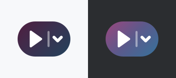
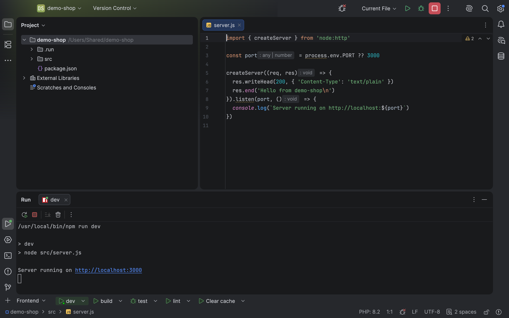

# Runners Bar



Plugin-ID `app.heckit.ide.runnersbar` · Vendor heck\it ([heckit.app](https://heckit.app)) · [JetBrains Marketplace](https://plugins.jetbrains.com/plugin/34701-runners-bar) · Quellcode: https://github.com/phse/runners-bar



IntelliJ-Plugin (PhpStorm, IDEA, … ab 2026.1), das direkt über der Statuszeile eine schmale Leiste
mit Lieblings-Run-Configurations einblendet.

- **+** (links) fügt eine Run Configuration hinzu oder legt eine neue Gruppe an (Popup mit Suche)
- **Gruppen**: Gibt es mehr als eine, erscheint neben dem + ein Umschalter. Darüber wechselt,
  benennt und löscht man Gruppen. Eine Konfiguration kann in mehreren Gruppen vorkommen.
- **Drag & Drop**: Tabs lassen sich per Ziehen umsortieren. Außerhalb der Leiste loslassen
  entfernt den Tab aus der Gruppe (Mülleimer-Icon und roter Rahmen zeigen das vorher an).
- **Klick auf einen Tab** startet die Konfiguration sofort (Run, oder Debug wenn umgestellt)
- **Pfeil** (oder Rechtsklick) öffnet das Menü:
  - Einmalig debuggen / einmalig ohne Debugger ausführen
  - Debug-Modus (Tab dauerhaft auf Debug umstellen)
  - Stoppen (wenn sie läuft)
  - Einstellungen… (Editor der Konfiguration)
  - Nach links / Nach rechts
  - Entfernen
- Laufende Konfigurationen sind grün hinterlegt und haben einen Punkt am Icon.
- Gibt es eine Konfiguration nicht mehr, bleibt der Tab mit Warn-Icon stehen, bis man ihn entfernt.
  Umbenennungen werden mitgezogen.
- Ein- und ausblenden über **View | Appearance | Runners Bar**.

Die Einträge werden pro Projekt in `.idea/workspace.xml` gespeichert, sind also persönlich und
landen nicht im VCS.

## Bauen und Starten

Gradle braucht ein JDK ab 17. Die Toolchain (JDK 25) lädt Gradle bei Bedarf selbst über foojay.

```
./gradlew runIde        # Sandbox-IDE mit Plugin starten
./gradlew buildPlugin   # build/distributions/runners-bar-<version>.zip
```

Prüfen gegen die lokale IDE und die älteste unterstützte Version (`verifyOldestVersion`):

```
./gradlew verifyPlugin
```

Installieren: *Settings | Plugins | ⚙ | Install Plugin from Disk…* und die ZIP auswählen.

Ohne weitere Einstellung lädt Gradle PhpStorm `platformVersion` (aus `gradle.properties`) als
Zielplattform herunter. Mit einer installierten IDE geht es schneller: `local.properties` anlegen
(wird nicht eingecheckt) mit z. B.

```
platformLocalPath=/Applications/PhpStorm.app
```

## Veröffentlichen (JetBrains Marketplace)

Die Beschreibung für den Marketplace steht in `src/main/resources/META-INF/plugin.xml`, die
Change Notes in `build.gradle.kts`, das Icon in `META-INF/pluginIcon.svg` (helles Theme) und `pluginIcon_dark.svg` (dunkles Theme).
Die IDE und der Marketplace lesen das Icon direkt aus der ZIP, es muss nicht extra hochgeladen werden.
Das Vorschaubild `marketplace/plugin-icon.png` oben in dieser README nach einer Icon-Änderung neu
erzeugen (Befehl unten). Frühere Entwürfe liegen in `marketplace/icon-proposals/`, das aktuelle
Icon ist Variante `2a-pille-luftig`.

```
T=$(mktemp -d)
rsvg-convert -w 120 src/main/resources/META-INF/pluginIcon.svg -o $T/l.png
rsvg-convert -w 120 src/main/resources/META-INF/pluginIcon_dark.svg -o $T/d.png
magick -size 180x160 xc:'#F7F8FA' $T/l.png -gravity center -composite $T/L.png
magick -size 180x160 xc:'#2B2D30' $T/d.png -gravity center -composite $T/D.png
magick $T/L.png $T/D.png +append marketplace/plugin-icon.png
```

1. Version in `gradle.properties` hochzählen, Change Notes ergänzen.
2. `./gradlew clean buildPlugin verifyPlugin`
3. **Erster Upload nur von Hand:** https://plugins.jetbrains.com/plugin/add, ZIP aus
   `build/distributions/` hochladen, Screenshots aus `marketplace/screenshots/` hinzufügen.
   JetBrains prüft das Plugin danach (meist 1-2 Werktage).
4. Spätere Versionen: Token unter https://plugins.jetbrains.com/author/me/tokens anlegen, dann
   `PUBLISH_TOKEN=… ./gradlew publishPlugin`.

Signieren ist optional (Variablen `CERTIFICATE_CHAIN`, `PRIVATE_KEY`, `PRIVATE_KEY_PASSWORD`,
siehe https://plugins.jetbrains.com/docs/intellij/plugin-signing.html).

## Screenshots neu erzeugen

```
./gradlew runIde -Pscreenshots=marketplace/screenshots
```

Kopiert `marketplace/demo-project` nach `/Users/Shared/demo-shop` (damit kein Benutzerpfad im Bild
steht), öffnet es in der Sandbox, startet `dev` und legt vier PNGs in
`marketplace/screenshots/` ab (Leiste, Tab-Menü, Gruppen, Hinzufügen). Die IDE zeichnet ihr Fenster
dafür selbst, Rechte für Bildschirmaufnahmen sind nicht nötig. Der Helfer liegt in
`src/screenshot/` und wird nur mit `-Pscreenshots` mitgebaut, nie im Release.

Voraussetzungen: Node unter `/usr/local/bin/node` (fest in den Demo-Run-Configurations) und
`/Users/Shared/demo-shop` als vertrauenswürdiges Projekt in der Sandbox. Fragt die Sandbox beim
ersten Lauf nach, einmal „Trust Project“ bestätigen und den Befehl erneut starten.

## Technik

Für den Bereich über der Statuszeile gibt es keinen offiziellen Extension Point. Das Plugin legt die
Statuszeile deshalb in einen eigenen Wrapper (Leiste oben, Statuszeile darunter). Baut die IDE die
Statuszeile neu ein (z. B. Präsentationsmodus), hängt sich die Leiste automatisch wieder davor. Beim
Entladen des Plugins wird der Ursprungszustand wiederhergestellt.

| Datei | Inhalt |
| --- | --- |
| `RunnersBarInstaller.kt` | Startup-Activity, Einhängen über der Statuszeile |
| `RunnersBarService.kt` | Projekt-Service, Persistenz, Einträge |
| `RunnersBarPanel.kt` | Leiste und „+“-Popup |
| `RunnersBarTab.kt` | Tab mit Klick-Start und Menü |
| `RunnersBarExecution.kt` | Starten (Run/Debug) und Erkennen laufender Prozesse |

## Lizenz

Apache License 2.0, siehe [`LICENSE`](LICENSE) und [`NOTICE`](NOTICE).
Copyright 2026 Peter Heck (heck\it). Name und Logo sind von der Lizenz ausgenommen.
